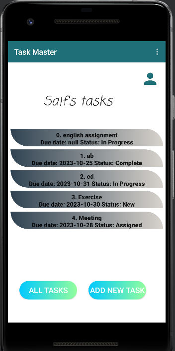
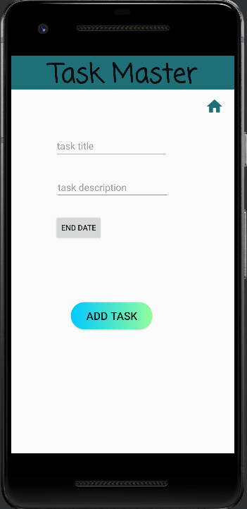
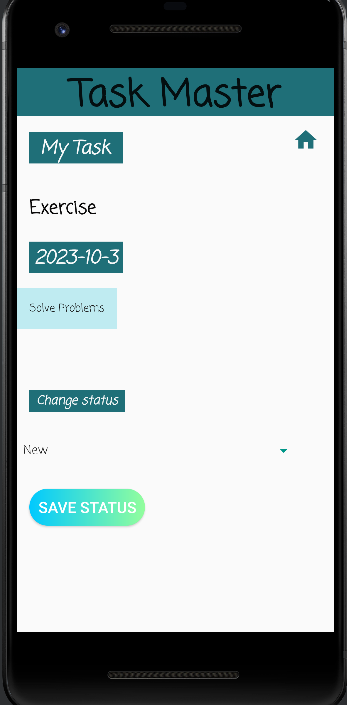
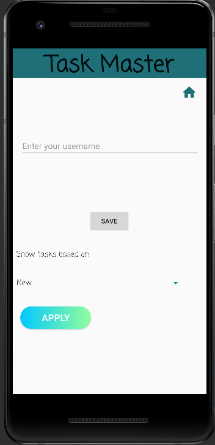

## TaskMaster

## description
Task master mobile application pp provides a user-friendly interface for managing tasks, allowing users to create, view, edit, and delete tasks.

1. home page with two buttons and list of tasks (Recycler View) with the username:
- Add new Task Button
- All Tasks Button
2. AddNewTask page:
- Add task button that show submitted label on the page when clicked.
- task description
- task title
- task end date.
3. AllTasks page:
- Image
- back button that back to home page.
4. Profile page:
- edit text for username.
- save button.
- filter tasks in home page.
5. Task details page:
- task title based on the clicked task.
- task description.
- task due date.
- update task state.
- delete task.
## daily change log
- Lab27
1. Add Task Details page with two text views: task title and task description. Task title is passed from intent in the main when the task button clicked.
2. Add Users Settings page with: edit text for the username and a save button. The username is passed using Shared Preferences to the home page. 

- Lab28
1. Add a  RecyclerView for displaying Task title, the tasks are hardcoded.
2. Add a  fragment for holding each Task title inside the textview, and reuse them for each task in the list.
3. Create a Task class with attributes: title, body and state. The state is enum of type TaskState, and can be one of: “new”, “assigned”, “in progress”, or “complete”.

- Lab29
1. Set up Room, and modify Task class to be an Entity.
2. Modify Add Task form to save the data entered in as a Task in local database.
3. Refactor homepage RecyclerView to display all Task entities from database.
4. User can update task details (state),delete task and can filter tasks on home page.

