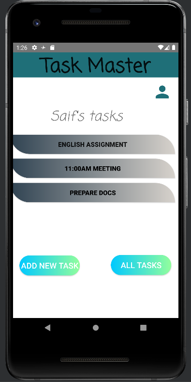
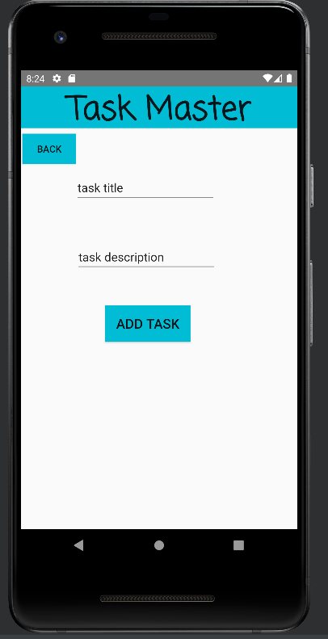
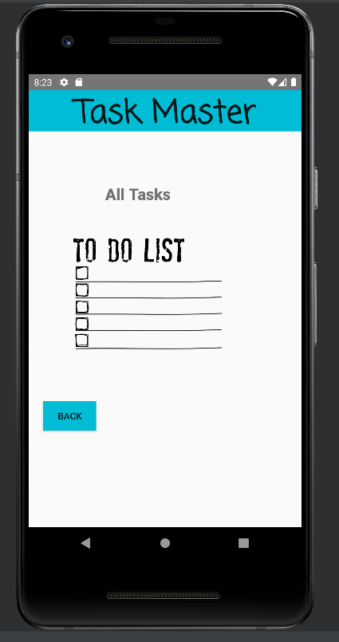
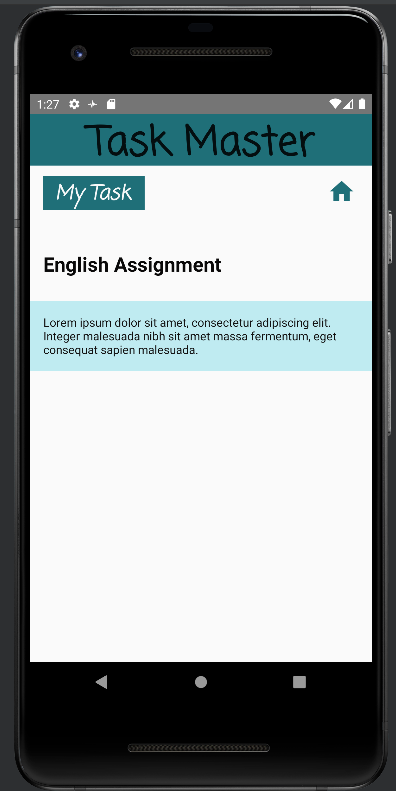
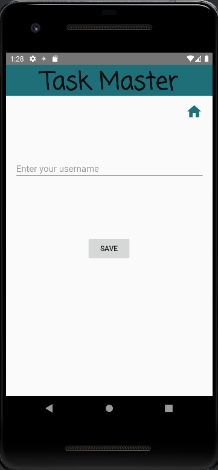

## TaskMaster

## description
Task master mobile application with 5 pages:
1. home page with two buttons and list of tasks with the username:
- Add new Task Button
- All Tasks Button
2. AddNewTask page:
- Add task button that show submitted label on the page when clicked.
- task description
- task title
3. AllTasks page:
- Image
- back button that back to home page.
4. Profile page:
- edit text for username.
- save button.
5. Task details page:
- task title based on the clicked task.
- lorem task description.
## daily change log
- Lab27
1. Add Task Details page with two text views: task title and task description. Task title is passed from intent in the main when the task button clicked.
2. Add Users Settings page with: edit text for the username and a save button. The username is passed using Shared Preferences to the home page.