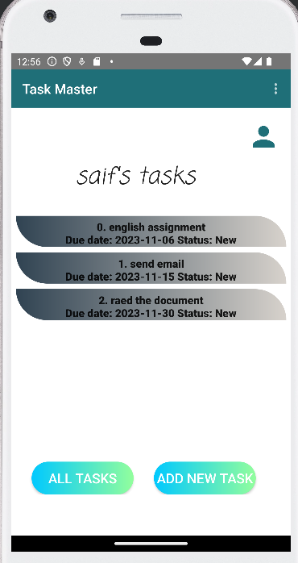

## TaskMaster

## description
Task master mobile application pp provides a user-friendly interface for managing tasks, allowing users to create, view, edit, and delete tasks.
Tasks are created and associated with teams, user can filter tasks based on his team and task state.

1. home page with two buttons and list of tasks (Recycler View) with the username:
- Add new Task Button
- All Tasks Button
2. AddNewTask page:
- Add task button that show submitted label on the page when clicked.
- task description
- task title
- task end date.
3. AllTasks page:
- Image
- back button that back to home page.
4. Profile page:
- edit text for username.
- save button.
- filter tasks in home page.
5. Task details page:
- task title based on the clicked task.
- task description.
- task due date.
- update task state.
- delete task.

## daily change log
- Lab27
1. Add Task Details page with two text views: task title and task description. Task title is passed from intent in the main when the task button clicked.
2. Add Users Settings page with: edit text for the username and a save button. The username is passed using Shared Preferences to the home page. 

- Lab28
1. Add a  RecyclerView for displaying Task title, the tasks are hardcoded.
2. Add a  fragment for holding each Task title inside the textview, and reuse them for each task in the list.
3. Create a Task class with attributes: title, body and state. The state is enum of type TaskState, and can be one of: “new”, “assigned”, “in progress”, or “complete”.

- Lab29
1. Set up Room, and modify Task class to be an Entity.
2. Modify Add Task form to save the data entered in as a Task in local database.
3. Refactor homepage RecyclerView to display all Task entities from database.
4. User can update task details (state),delete task and can filter tasks on home page.

- Lab31
1. Polish the application and ensure that every feature is added and its style is ready.

- Lab32
1. Remove Room dependencies and room connections from the application and ensure that its functionality works correctly.
2. Saving tasks in Dynamo db and showing (retrieve) them in the main activity.

- Lab33
1. Create Team model and associate it with the Task (one team `has many` tasks,  task `belongsto` team).
2. Choose the team associated when creating a task, and filter the tasks on the main activity based on team.

- Lab34
1. Adding new activity: Edit Task Activity which let the user edits the task info and save the updated info.
2. User can delete the task.

- Lab36
Include *Cognito* authentication, so the user can signup with email and password then he need to verify the email, after this the user can login to the app and logout.
1. Adding new 3 activities: Signup activity, VerifyAccount Activity and Login Activity.

- Lab37
1. In the Add Task activity: allow th user to pick an image, the picked image will be uploaded to S3 and attached with the task.
2. Update the Task model to include a image of type string.
3. In Task Details Activity: the image associated with task is rendered.

- Lab38:
1. Use Intent filter to allow the user to share images from another apps to Task Master and show the image in the Add Task Activity.

- Lab39:
1. Use location `getLastLocation()` and `getCurrentLocation()` to add the location of the new task. The location is determined inside the AddNewTaskActivity and saved with the task (Longitude and Latitude).
2. Use *geocoder* to determine the address of the task using its longitude and latitude and display the address in the TaskDetailsActivity. 